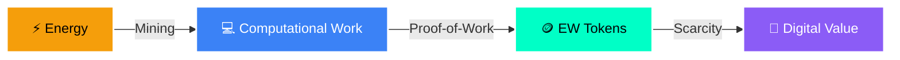

# ⚡ EnergyWork (EW) — Thermodynamic Money Primitive

<div align="center">

<!-- Animated Gradient Header -->
```
╔══════════════════════════════════════════════════════════════════════╗
║                                                                      ║
║   ⚡ ENERGYWORK ⚡                                                   ║
║   ━━━━━━━━━━━━━━━━                                                  ║
║   Mine the Future with Pure Energy                                   ║
║                                                                      ║
╚══════════════════════════════════════════════════════════════════════╝
```


---

### 💬 *"The future of currency will be work and energy."*
**— Elon Musk** *(etched forever on-chain)*

---

<p align="center">
  
  
  
  
</p>

</div>

---

## 🌟 What is EnergyWork?

<table>
<tr>
<td width="60%">

**EnergyWork** is the **first pure proof-of-work token** on Ethereum where every token is minted directly from **real electricity expended**.

In the coming age of AI abundance, goods become limitless. The final scarce resource is **energy** — watts turned into useful work.

**EW embodies that truth.**

</td>
<td width="40%">

```ascii
    ⚡
   ╱│╲
  ╱ │ ╲
 ╱  │  ╲
╱   │   ╲
════╧════
 ENERGY
   ↓
   EW
```

</td>
</tr>
</table>

---

## ✨ Key Features

<div align="center">

| Feature | Description |
|---------|-------------|
| ⛏️ **Bitcoin-Style Emission** | Starts at 50 EW per block → halves every 210,000 mines → ~21M total supply |
| 🌐 **Browser-Mineable** | Works on any laptop — no special hardware needed |
| 📊 **Fixed Low Difficulty** | Early energy claims the asymmetric reward |
| 🔒 **Immutable Vision** | Elon's quote permanently on-chain |
| ✅ **Fully Verified** | Source code verified on Etherscan |

</div>

---

## 🚀 Start Mining NOW

<div align="center">

### 👉 **[⚡ MINE NOW — INSTANT BROWSER MINING ⚡](https://sativuscrocus.github.io/energywork-miner)**


</div>

### ⚙️ Quick Start Guide

```bash
# 1. Open Miner
🌐 https://sativuscrocus.github.io/energywork-miner

# 2. Connect MetaMask (Ethereum Mainnet)
🦊 Click "Connect Wallet"

# 3. Paste Contract Address (if needed)
📋 0xb5e3fe1a9118f5ec13e36ddcb3c1d600a01918

# 4. Start Mining
⚡ Click "Start Mining" button

# 5. Watch Your CPU Convert Energy → EW
📈 Real-time stats displayed
```

<div align="center">

**⏰ Current Block Reward: `50 EW` (Early Era — Claim While It Lasts!)**


</div>

---

## 📜 Smart Contract

<div align="center">

<table>
<tr>
<td align="center" width="50%">

### 📍 Contract Address

```
0xb5e3fe1a9118f5ec13e36ddcb3c1d600a01918
```

</td>
<td align="center" width="50%">

### 🔗 Quick Links

[](https://etherscan.io/address/0xb5e3fe1a9118f5ec13e36ddcb3c1d600a01918)

[](https://etherscan.io/token/0xb5e3fe1a9118f5ec13e36ddcb3c1d600a01918)

</td>
</tr>
</table>

```
✅ Verified Source Code — Exact Match
👤 Creator: 0x59e0239e... (Fair Launch — No Special Privileges)
🔐 No Admin Keys • No Upgradeable Proxies • Fully Immutable
```

</div>

---

## 🌍 Why This Matters

<div align="center">



</div>

<table>
<tr>
<td width="33%" align="center">

### 🔗 Bitcoin showed us
**Energy → Digital Scarcity**

Proof-of-work creates unforgeable costliness through energy expenditure

</td>
<td width="33%" align="center">

### ⚡ EW takes it further
**Accessible Energy Primitive**

Lightweight, browser-based mining for the post-scarcity world

</td>
<td width="33%" align="center">

### 🚀 Early Watts Win
**Asymmetric Opportunity**

First miners capture highest rewards before halving events

</td>
</tr>
</table>

---

## 📊 Tokenomics at a Glance

<div align="center">

```
╔═══════════════════════════════════════════════════════════╗
║                                                           ║
║   Total Supply Cap:     ~21,000,000 EW                   ║
║   Initial Block Reward:  50 EW                            ║
║   Halving Interval:      Every 210,000 blocks             ║
║   Mining Method:         CPU/GPU Proof-of-Work            ║
║   Premine:               0 (Zero)                         ║
║   Team Allocation:       0 (Zero)                         ║
║   VC Rounds:             0 (Zero)                         ║
║                                                           ║
║   ⚡ 100% FAIR LAUNCH ⚡                                  ║
║                                                           ║
╚═══════════════════════════════════════════════════════════╝
```

### 📈 Emission Schedule

| Era | Blocks | Reward per Block | Total EW Minted |
|-----|--------|------------------|-----------------|
| 🥇 **1** | 0 - 210,000 | **50 EW** | 10,500,000 |
| 🥈 **2** | 210,001 - 420,000 | 25 EW | 5,250,000 |
| 🥉 **3** | 420,001 - 630,000 | 12.5 EW | 2,625,000 |
| ... | ... | ... | ... |
| ♾️ **∞** | ~6,930,000+ | ~0.00000001 EW | Approaches 21M |

</div>

---

## 🛠️ Resources

<div align="center">

### 🔗 Official Links

<p>
  <a href="https://github.com/SativusCrocus/energywork-miner">
    
  </a>
  <a href="https://github.com/SativusCrocus/energywork-miner/blob/main/EnergyWork.sol">
    
  </a>
  <a href="https://twitter.com/EnergyWorkEW">
    
  </a>
</p>

### 📚 Documentation

| Resource | Link |
|----------|------|
| 📖 Whitepaper | *(Coming Soon)* |
| 💻 Mining Guide | [Getting Started](https://github.com/SativusCrocus/energywork-miner#readme) |
| 🔧 Developer Docs | [API Reference](https://github.com/SativusCrocus/energywork-miner/wiki) |
| 💬 Community | [Discord](https://discord.gg/energywork) *(add when ready)* |

</div>

---

## 🎯 Roadmap

<div align="center">

```
┌─────────────────────────────────────────────────────────────┐
│                                                             │
│  ✅ Q4 2024 — Fair Launch on Ethereum Mainnet              │
│  ✅ Q1 2025 — Browser Miner Release                        │
│  🔄 Q1 2025 — Community Building & Documentation           │
│  📍 Q2 2025 — DEX Liquidity Pools & Trading                │
│  📍 Q3 2025 — Mobile Mining App                            │
│  📍 Q4 2025 — Cross-Chain Bridge & Governance              │
│                                                             │
└─────────────────────────────────────────────────────────────┘
```

</div>

---

## 🤝 Community

<div align="center">


<p>
  <a href="https://twitter.com/EnergyWorkEW">
    
  </a>
  <a href="https://github.com/SativusCrocus/energywork-miner">
    
  </a>
</p>

</div>

---

## ⚠️ Disclaimer

```
⚡ EXPERIMENTAL PROTOCOL ⚡

EnergyWork is an experimental proof-of-work token. Mining involves real 
electricity costs and computational resources. This is not financial advice.

• Do Your Own Research (DYOR)
• Mine Responsibly
• Understand gas costs on Ethereum
• Early participants take on higher risk/reward

The protocol is immutable once deployed. No guarantees are made about
token value, liquidity, or future developments.
```

---

<div align="center">

## ⚡ **Mine the Future. Turn Energy into Ownership.** ⚡

```
╔════════════════════════════════════════════════════╗
║                                                    ║
║   Early Participants Forge the Primitive          ║
║                                                    ║
║   🔥 Start Mining Today 🔥                        ║
║                                                    ║
╚════════════════════════════════════════════════════╝
```

### 👉 **[⚡ START MINING NOW ⚡](https://sativuscrocus.github.io/energywork-miner)**

---

<sub>Built with ⚡ by the EnergyWork community | MIT License | Powered by Ethereum</sub>


</div>

---

## 🌟 Star History

<div align="center">

[](https://star-history.com/#SativusCrocus/energywork-miner&Date)

</div>

---

<div align="center">

**⚡ Power the future with every watt ⚡**

*EnergyWork — Where Energy Becomes Value*

</div>
